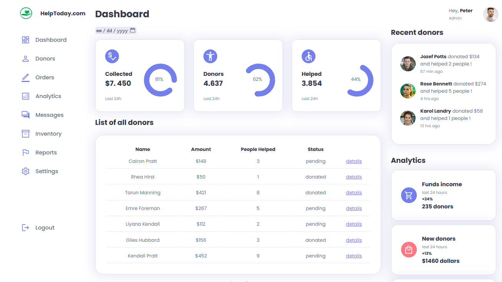

# 🛠 Sass - Admin panel

# 🔗 [Live Preview](https://stately-rabanadas-563c44.netlify.app/)

## Welcome! 👋

- This was a huge learning project in which I practiced how to use Sass features and how to better understand styling. I did not code this entirely by myself, rather it was a YouTube tutorial through which I was testing my skills. It is fully responsive for mobile sizes but it's not perfect. It is 95% finished because other projects took priority.

### Languages and features 👨‍💻 

- Sass: mixins, variables, responsive, nesting, partials.
- JS: on-click modifying style properties

Thanks for checking out my projects.
